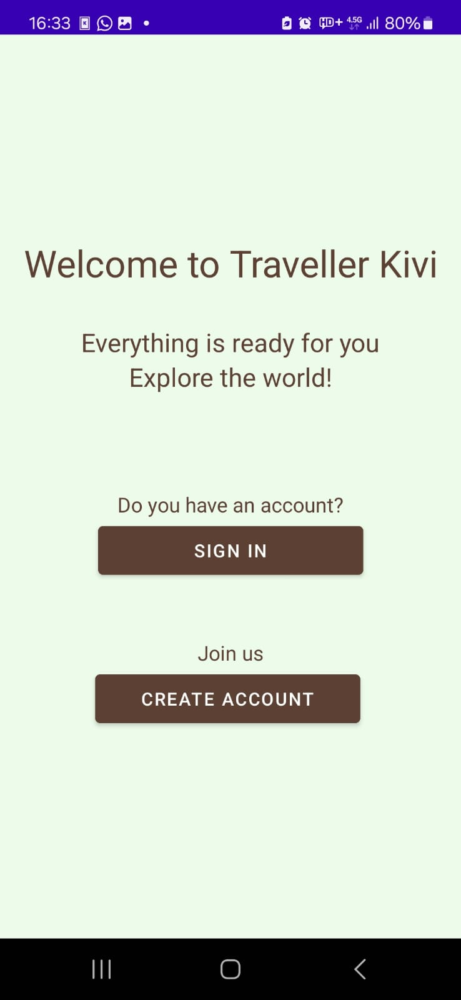
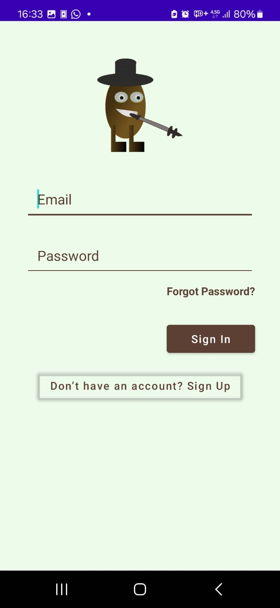
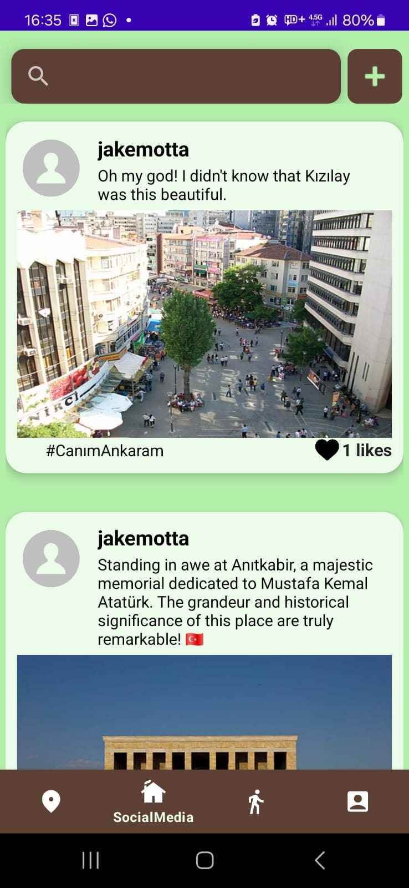
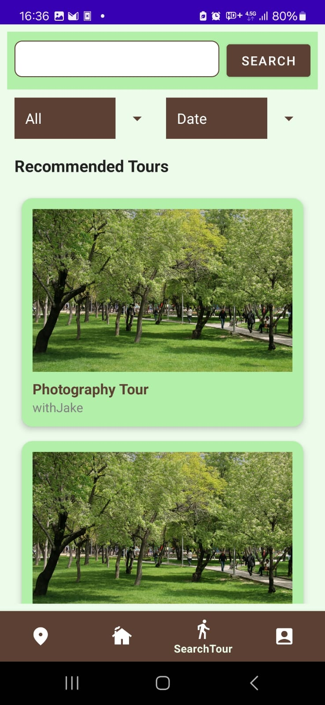
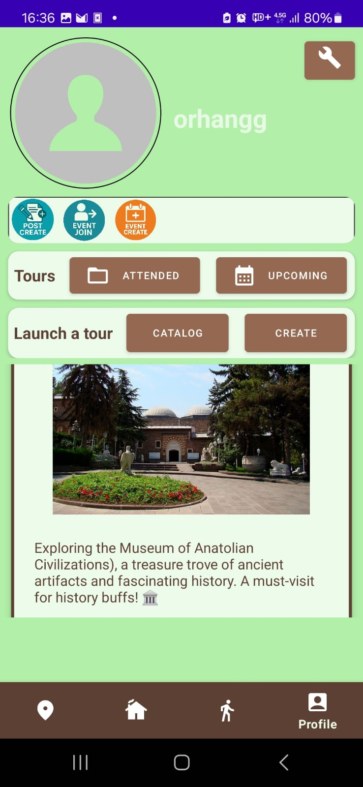
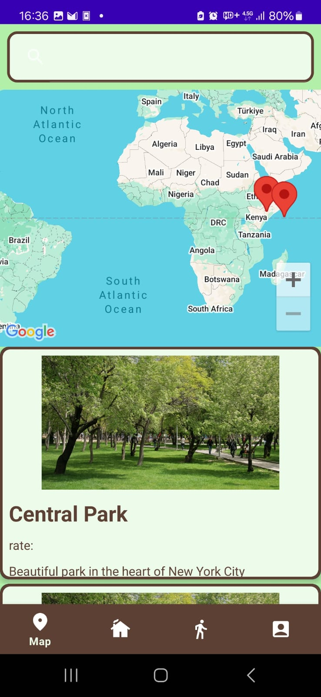

# Traveller Kivi - Tour and Guide Finding Application

## Introduction
  Our app is Traveller Kivi, a social media for finding events and connecting with people who love traveling. You can find nearby user-organized events such as city tours and gatherings suitable for you and also explore the city with a curated selection of tourism attractions. Our app also doubles as a social media where you can share knowledge and communicate with other outdoorsy people.

## Project Details 
## 1. User Features
## 1.1 Profile
Each user has their own profile. They can update their profile pictures, username etc. While they attend more tours and travel by themselves they will earn achievements which they can show in their profile as badges. They will have access to their tour history and from there they will be able to make comments about the tours they attended and rank the tour guides that led them.
## 1.2 Finding a tour
The users except guides are not allowed to add new tour routes to the system but they can join the ones that are most suitable for them. When finding a tour guide, users can enter the location where they want to explore and they can view the available routes which includes specific locations searched by users. They can also sort the tours according to some properties such as ranks of guides and comments of tours to choose the most suitable events for them. Additionally, they can check the most popular places via this app and choose a place from the created lists to visit by themselves.
## 1.3 Social media page
Our application will provide a page where users can share their experiences from their traveling adventures, places they discovered and anything about traveling. In that way our aim is to construct a community full of travelers who explore and learn together. In that page also some advice will be provided by application such as some tours that are highly demanded by other users and loved.

## 2 Guide Features
## 2.1 Guide Profile
Each guide has their own profile, which includes their name, experience, and a list of upcoming and past routes they have prepared. Travelers can submit reviews and ratings based on their tour experiences, allowing them to evaluate the guide’s performance. This feedback is available on the guide’s profile which is seen by normal users. Additionally, guides can announce upcoming events and inform travelers about new updates. 
## 2.2 Creating a New Tour
While creating a new tour guide is going to specify the route, locations they will go, the quota of how many travelers will be accepted, the date of the tour, average time of the tour duration, and if there is any transportation will be used they also will give this information as well. Additionally, guides will be able to give some additional information which the guide thinks important, for example the information about weather might be important and the guide can inform the travelers about this and give an advice about which clothes should be chosen by writing them on the note page in the tour page.
## 2.3 Features on the existing tours
Guides will be able to make any updates except changing the whole route on their existing tours. They may delay and cancel it or just add new information to the note page. Also when a normal user selects a tour, the guide of this tour will see this information and the guide can confirm this request or if he/she doesn’t want this user in his/her tour will be able to object to this request.
  
## Screenshots
These are some screenshots of the application.

  
  
  
  

  
  
  
  

## Installation instructions
1. Clone the repo
2. Open the project in Android studio.
3. Build the prodDebug variant.
4. Set up the backend [server](http://github.com/cigneve/kivi) to listen on `http://localhost:45976` (localhost of the device running Android app, you might want to use a reverse proxy).
5. Run the Android application

## Contributors
Feyza Zeynep Bilgin  
Çağla Güneş Ocaklı  
Eftelye Çoban  
Kerem Çınar  
Yusuf Said Aktan  
